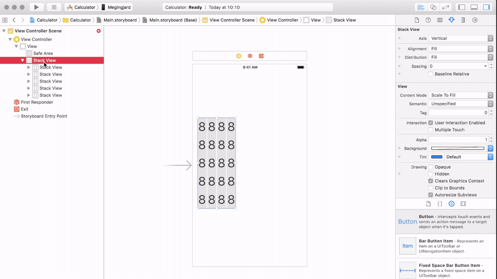
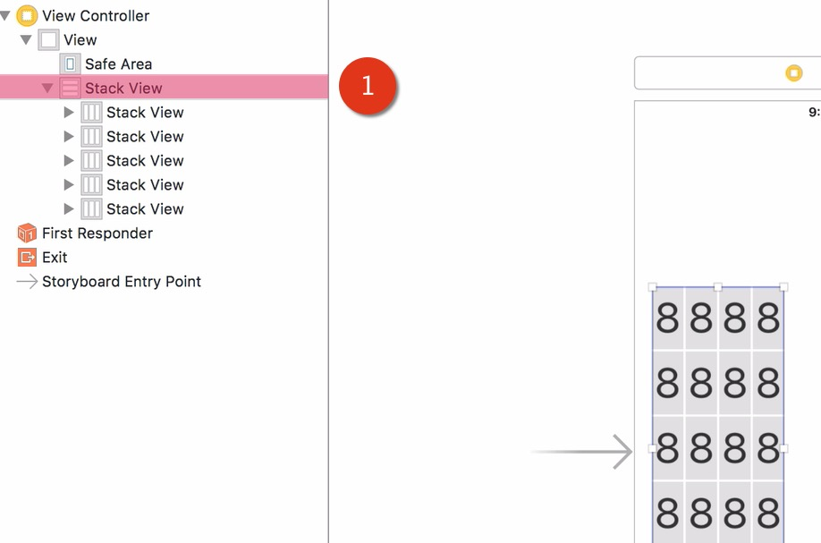
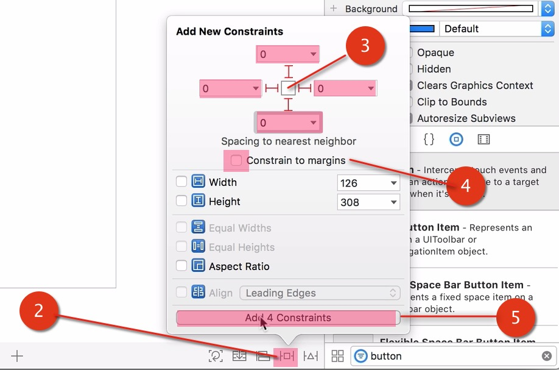
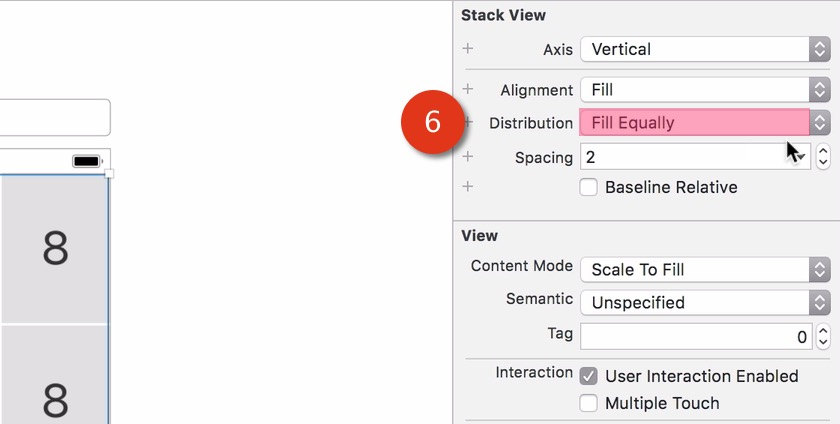
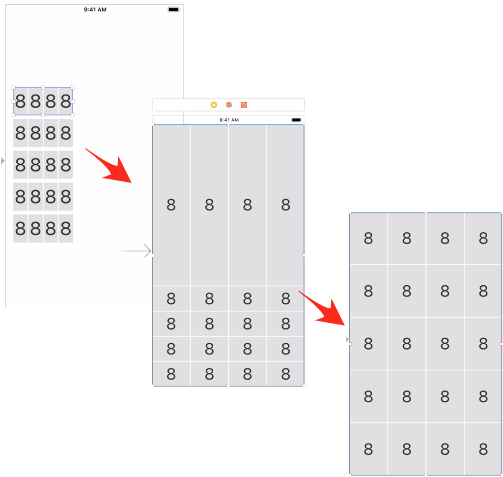

# Simple iOS11 Apps for Reference: Stack View

How to get a nested group of stacked views to expand and fill the entire container:

Select the parent Stack View container...

Add constraints to all edges of the parent container so that it occupies all the available space of the view container...

Finally, by letting the distribution to fill equally, all the children stack views fill up all the spaces in the parent stack view.

BEFORE and AFTER:

