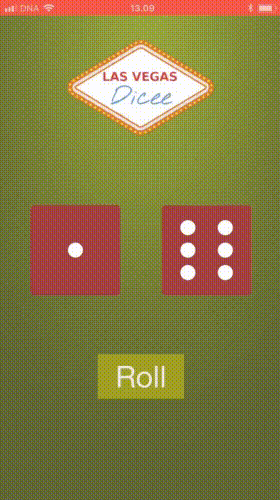
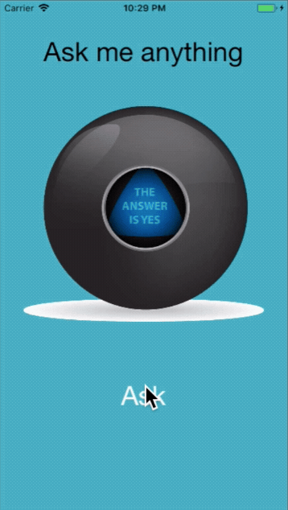
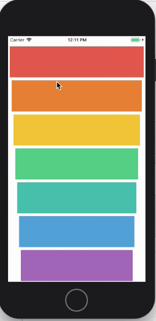
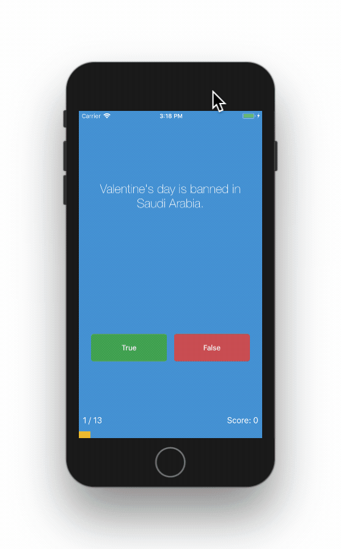

# Simple iOS11 Apps for Reference

## [Dicey](https://github.com/islandjoe/ios11-apps/tree/dicey-app)

Rolls the dice when the button is tapped and when the phone is shaken.

[Making the app video](https://youtu.be/MqXCcnOHnRY)

## [Magic 8 Ball](https://github.com/islandjoe/ios11-apps/tree/magic-8-ball)

[Making the app video](https://youtu.be/1phjyRW3Qcg)

## [Xylophone](https://github.com/islandjoe/ios11-apps/tree/xylophone)

Incorporating sound using `AVFoundation`

[Making the app video](https://youtu.be/_k6sUbOPFFo)

## [Quiz](https://github.com/islandjoe/ios11-apps/tree/quiz-app)

Utilizing MVC design pattern

